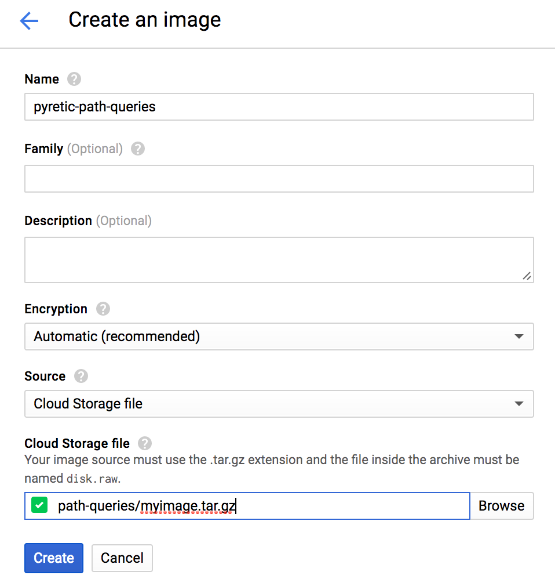
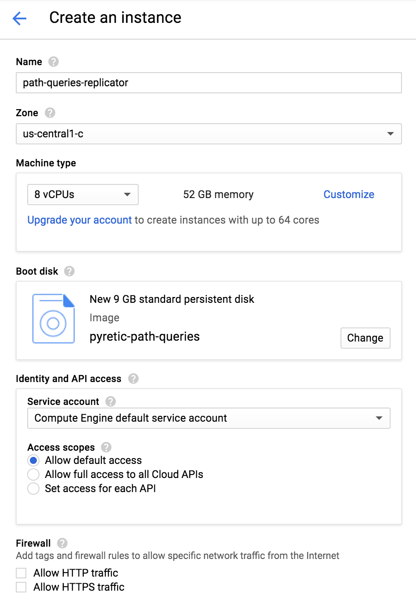

# path-queries

This repository contains a set of scripts to help you replicate
[Path Queries for Interactive Network Debugging](http://web.mit.edu/~alephtwo/www/pathqueries.html)
(NSDI '16) on Google Cloud.

Most of the scripts you care about are in the `replicate` subfolder;
you will run these on your own computer. The `test/rep_tests.sh`
script determines which tests are run on the VM, so you may want to
tweak those.

The `plotting` subfolder contains scripts which run on the VM to parse
and plot results; they automatically emit charts similar to those in
the paper. The `reference` subfolder contains scripts which we used to
set up the VM image or to do other miscellaneous work. You probably
won't need those.

## Instructions

You'll import our VM image, then use the imported image to make a
virtual machine, then use our script to run the tests on the machine,
then use another script to plot the results.

### Import the image

First, you'll import our premade virtual machine image (which has the
path query system already set up) into your Google Cloud project.

1. Log into the
   [Google Cloud console](https://console.cloud.google.com/) in your
   browser. You should have accepted the terms of service, set up a
   project, enabled billing, and wired the project to a billing
   account -- in other words, you should be in a state where you can
   make a new instance.

2. Click on Compute Engine on the left-side menu, then go to the
   [Images section](https://console.cloud.google.com/compute/images).

3. Click Create Image in the toolbar at the top.

4. Let Name be `pyretic-path-queries`, and change Source to be 'Cloud
   Storage file' instead of Disk. Leave the Optional fields blank.

   For the Cloud Storage file, type in `path-queries/myimage.tar.gz`,
   which is the public URL for the image we made. (We based it on the
   [Pyretic 0.2.2 VM on their website](https://bitbucket.org/reich/pyretic-vms/downloads/Pyretic-0.2.2-amd64.zip).
   We took it and installed extra packages like the Frenetic compiler
   for path query tests and subsequent analysis.)

   

5. Click Create. Wait for the operation to go through; the new
   `pyretic-path-queries` image should show up in the Images list.

### Create the virtual machine instance

1. Go to the
   [VM instances](https://console.cloud.google.com/compute/instances)
   section of the Compute Engine console. Click Create to go to the
   'Create an instance' screen.

2. Name the new instance `path-queries-replicator`.

   You should probably choose a zone in a region where you don't have
   any existing VM instances: if you already had a VM instance in
   `us-west1-c`, for example, then you shouldn't pick any zone in
   `us-west1` here. We're going to spin up an eight-core VM, which
   is likely to reach your region cap for Google Cloud.

   Choose machine type `n1-highmem-8`, which has 8 vCPUs and 52 GB of
   memory.

   Change the boot disk: in the boot disk screen that pops up, go to
   'Custom images' and select the `pyretic-path-queries` image.

   

   If you want, you can go into the 'Management, disk, networking, SSH
   keys' section and make the instance preemptible to save money,
   although then you risk having to resume it if it gets terminated.

3. Click Create. Wait for the operation to complete. When you get an
   External IP for the new instance in the list of instances, you're
   ready to run the tests.

### Run the tests

1. Clone this repository on your own computer (not on the VM
   instance). Go to the `replicate` subfolder.

2. Run `./replicate-in-vm.sh EXTERNALIP` where `EXTERNALIP` is the
   external IP of the instance you just made.

   You may get prompted to approve a key fingerprint (say yes) or to
   enter a password for user `mininet` on the machine (the password is
   `mininet`) when each command runs.

If something goes wrong, you can try ssh-ing into `mininet@EXTERNALIP`
and delete the `path-queries` folder, then rerun the replicate
script. At worst, you can make a new instance.

3. You should see the scalability trend tests running, starting with
   run 1 and `igen_delauney`. These tests attempt to compile path
   queries on increasingly large synthetic networks (up to 100 nodes);
   they track how many rules are emitted and how long the compilation
   takes.

   The tests should take about 5-6 hours to complete.

   Note that the tests run inside `screen` over `ssh`. If you lose
   connection, they'll keep running on the instance. You can see a
   full log in `~/path-queries/screenlog.0` on the VM, and you can ssh
   into the VM and do `screen -x` to reattach to the test terminal if
   you lose the original session.

### Plot the results

Once the tests have all completed (signals: `replicate-in-vm.sh`
terminated successfully, screen no longer exists, the `screenlog.0`
shows that a test ended and no further tests ran), we can view the
results.

Go to the `replicate` subfolder on your computer. Run
`./get-results.sh EXTERNALIP`. The results will appear in the
`replicate/results` subfolder.

FIXME: what do the results mean?

Make sure you turn off the giant VM instance when you're done using
it!
